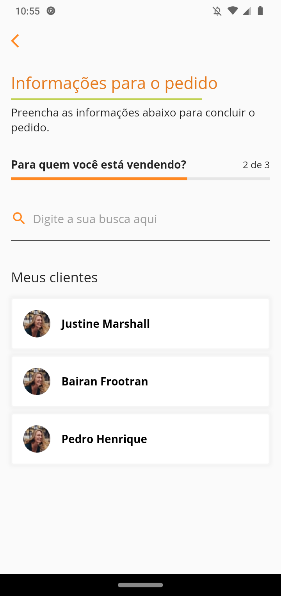

<h1  align="center">
<br>
</h1>

<h3 align="center">
    Front-end da aplicação para solicitação de pedidos em um café fictício.
</h3>


<p align="center">


</p>

# Visão Geral

Esta aplicação foi desenvolvida durante o processo de seleção para programador mobile Júnior da empresa Maida Health, esta aplicação contempla o front-end da solução, ou seja, não utiliza o consumo de dados de nenhuma API externa.

# Tecnologias utilizadas

<br>

*  - Linguagem de programação utilizada pelo Framework Flutter.
*  - Framework utilizado no desenvolvimento da aplicação.
*  - Biblioteca utilizada para facilitar a gerência de estado da aplicação.


# Modelagame da aplicação

Esta seção irá mostrar como a aplicação foi modelada para que pudesse atender todas as necessidades propostas da descrição do desafio.

A modelagem foi criada antes de iniciar o desenvolvimento da aplicação, com o objetivo de guiar o desenvolvimento e evitar erros que pudessem atrapalhar o andamento do desenvolvimento.

## Modelagem das classes


### Descrição das classes

* **User** - Classe referente ao usuário logado na aplicação, é a classe principal da aplicação, entre os atributos da classe User, destaco o food_categories e o demands, o primeiro atributo citado armazenam informações sobre as categorias com as comidas que um usuário possui, comidas que estão disponíeis para venda, e o segundo atributo refere-se a lista de pedidos que o usuário possui.

* **Food Category** - Classe que possui uma lista de comidas (Food).

* **Food** - Classe com informações das comidas.

* **Client** - Classe com informações dos clientes registrados.

* **Demand** - Classe com informações de um pedido.

* **Food Demand** - Classe auxiliar, esta classe serve para auxiliar a classe Food e Demand, onde, um pedido possui uma lista de comidas e para cada comida dessa lista há uma quantidade de unidades selecionada, exemplo 3 unidades de misto quente. Esta classe mantém informações da comida selecionada na classe de pedido (Demand).

* **Demand Date** - Classe auxiliar, o objetivo dessa classe é facilitar a apresentação dos pedidos em suas respectivas datas.

## Mapa da aplicação


### Descrição das páginas

* **Login** - A página de login é a primeira página apresentada na aplicação, a função dessa página é controlar o acesso ao resto da aplicação. Dois requisitos devem ser satisfeitos para que um usuário possa ativar o botão de login da página, que são elas, o e-mail deve ser válido e a senha deve conter pelo menos 6 caracteres.

* **History** - A página de histórico apresenta todos os pedidos salvos do usuário logado.

* **Demand Information** - Esta é a primeira página apresentada no processo de criação de um pedido, esta é a página onde as comidas podem ser selecionadas e a página de seleção de comida possa ser chamada.

* **Select food** - Página responsável por obter informações sobre uma comida selecionada na página Demand Information, esta página irá obter os dados da comida selecionada e retornar uma nova comida para a página Demand Informations.

* **List Clients** - Página apresentada quando a página Demand Information está concluída, esta página lista os clientes disponíveis para seleção, onde a seleção de um cliente indica que este cliente está fazendo a compra da comida.

* **Demand Status** - Página para obter informações sobre o status do pedido.

* **End** - Página que informa a finalização do pedido, a partir dessa página o usuário possui duas opções, ir para a página History ou fazer um novo pedido em Demand Information. 

# Pré-requisitos

O desenvolvimento dessa aplicação utiliza como base as seguintes tecnologias e versões apresentadas abaixo. Caso ocorra algum erro na execução da aplicação ou mesmo nos comandos de configurações, verifique se a versão do Dart e do Flutter no seu computador estão devidamente atualizados.

1. Dart 2.10.0 (stable)
2. Flutter 1.22.1 (stable)
3. git version 2.17.1


# Instalação

1.  Clone ou faça o download do repositório:
    ```bash
    git clone https://github.com/PedroHenriqueDevBR/Appetit-app.git
    ``` 
2. Acesse a página da aplicação e execute o seguinte comando:
    ```bash 
    # Obter as dependências do projeto
    flutter pub get 
    ```
    ```bash 
    # Executar o MobX
    flutter pub run build_runner build
    ```
    ```bash
    # Executar o projeto
    flutter run 
    ```


## Funcionalidades
- [x] Páginas de login;
- [x] Página com lista de pedidos efetuados;
- [x] Página de novos pedidos;
- [x] Página de detalhamento do pedido;
- [x] Página de selecionar clientes;
- [x] Página de adicionar informações ao pedido;
- [x] Feedback do pedido realizado.

# Screenshots (All screenshots)

## Login

<div>


</div>

## History
<div>


</div>

## Demand information
<div>


</div>

## Select product
<div>


</div>

## Client List
<div>



</div>

## Demand Status
<div>


</div>

## End
<div>

</div>
